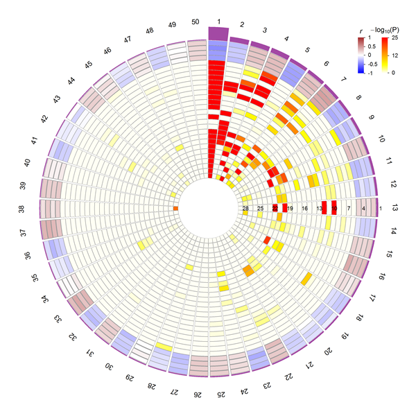
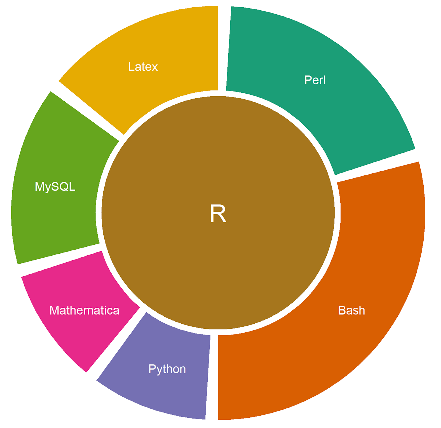

## NetWeaver [](https://cran.r-project.org/package=NetWeaver) [](http://www.r-pkg.org/pkg/NetWeaver)

### Current version 0.0.3

### Description
`NetWeaver` is motivated towards developing a simple and flexible pipeline for visualizing the complex features of enrichment and correlation of gene coexpression network modules. While circos style 2D track plot is one natural choice for such practice, existing packages are designed primarily for handling genome structure and intervals. They are either too complicated to use, requiring certain level of knowledge of scripting, or limited in applications to only genomic structure data. To address these issues, particularly extend beyond applications in genomic structure data, `NetWeaver` offers a lightweight implementation of circular track plot, providing simple and flexible R function utilities and pipelines to generate circular images for visualizing different types of structure/relationship data.

### Installation
`NetWeaver` is available from `CRAN` so the simplest way to install in `R` is by running `install.packages("NetWeaver")`. To install the latest development from here in `github`, run `devtools::install_github("mw201608/NetWeaver")` in `R`.

### Example 1: curcular track plot


The above figure is generated from a real data analysis featuring coexpression network modules. The numbers in the out-most ring show the module id 1-50. The barplot in track #1 shows the module ranking score. The heat-map in track #2-5 shows module-trait correlation. The heat-map in the remaining tracks #6-29 show the P value significance of enrichment for various gene signatures.
Detailed description about the data and sample code is available from
`vignette("netweaver")` or `?Modules`.

In general, a typical workflow of a circular track plot includes:

1. initialize plot parameters

```
rc.initialize(.....)
```

2. prepare plot canvas

```
rc.plot.area(.....)
```

3. plot chromosome cytoband (optional)

```
rc.plot.ideogram(.....)
```

4. plot heat-map, histogram, barchart, etc.

```
rc.plot.histogram(....)
rc.plot.heatmap(....)
```

5. plot links/ribbons in the middle

```
rc.plot.link(....)
rc.plot.ribbon(....)
```

Another example pipeline for plotting a hypothetical data is shown in the sample code of function `rc.initialize`.

### Example 2: donut pie-chart
##### By Erica Liu



**Load libraries**
```
library(NetWeaver)
library(RColorBrewer)
options(stringsAsFactors=FALSE)
```

**Set up example data and colors**
```
dat=c(Perl=0.2,Bash=0.3,Python=0.1,Mathematica=0.1,MySQL=0.15,Latex=0.15)*100
cols=brewer.pal(length(dat)+1,'Dark2')
Cyto=data.frame(Chr=names(dat), Start=1, End=dat, BandColor=cols[1:length(dat)])
```
**Initialize**

```
rc.initialize(Cyto, num.tracks=3, params=list(chr.padding=0,track.padding=0,track.height=0.29))
```

**Make plot area**

```
rc.plot.area()
```

**Plot outer layer**

```
rc.plot.histogram(Cyto,track.id=2,color.col='BandColor',track.border=NA)
textData=data.frame(Chr=Cyto$Chr,Pos=Cyto$End/2,Label=names(dat))
rc.plot.text(textData, track.id=2.5, col='white')
```

**Print circle and text in the middle**

```
x2 <- c(seq(-0.4, 0.4, 0.002), seq(-0.4, 0.4, 0.002))
y2 <- c((  1 * (0.16 - x2[1:401]^2)^0.5 ), ( -1 * (0.16 - x2[402:802]^2)^0.5 ))
y2[1]=y2[401]=y2[402]=y2[802]=0
polygon(x2,y2, col = cols[1+length(dat)],border = NA)
text(0,0,labels='R',cex=2,col='white')
```
